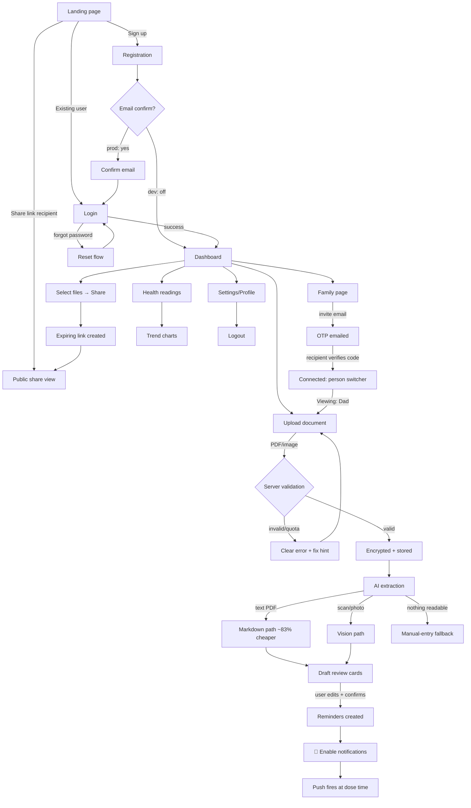

# EvoDoc — Product Requirements Document (PRD)

**Version:** 1.0 · **Status:** Living document · **Companion:** [SYSTEM-DESIGN.md](SYSTEM-DESIGN.md)

> **How to read this document.** EvoDoc is not a greenfield concept — a working,
> tested implementation exists. Features are marked **✅ Built**, **🔶 Partial**,
> or **⬜ Planned** so this PRD doubles as a gap analysis. Where the original
> product assumptions conflict with evidence, this document says so explicitly
> in **⚠️ Challenge** blocks rather than politely designing the wrong thing.

---

## 1. Product Vision

### 1.1 The problem

Medical information in most households — especially across India and similar
markets — lives as paper: prescriptions in drawers, lab reports in WhatsApp
chats, discharge summaries in plastic folders. The consequences are concrete:

- **Lost context at the point of care.** A doctor asks "what are you currently
  taking?" and gets a shrug or a crumpled slip.
- **Medication non-adherence.** WHO estimates ~50% of chronic-disease patients
  don't take medication as prescribed; forgetting is the top cited reason.
- **Caregiver blindness.** The adult child managing an aging parent's health
  has no reliable window into what was prescribed, what was taken, or what the
  last report said — especially at a distance.
- **Unsafe sharing.** Records get emailed or WhatsApped as unencrypted
  attachments to whoever asks, with no expiry and no revocation.

### 1.2 What EvoDoc is

A **secure family health record**: encrypted document storage, AI that reads
prescriptions into structured medication reminders, self-tracked vitals, and
two sharing primitives that don't exist together anywhere else at consumer
level —

1. **Expiring, instantly-revocable doctor links** (recipient needs no account),
2. **OTP-verified family connections** (view + add on each other's records).

### 1.3 Target users & positioning

> **⚠️ Challenge — who is the primary user?**
> The stated assumption is "patients manage their own records." Evidence from a
> decade of dead consumer PHRs (Google Health 2011, Microsoft HealthVault 2019)
> says healthy individuals will not do filing homework for a deferred payoff.
> **Recommendation: position caregiver-first.** The primary persona is the
> adult child managing a parent's health — they have recurring, high-stakes,
> *emotional* motivation, they generate word-of-mouth (siblings get invited),
> and EvoDoc's differentiated features (family linking, remote reminder setup,
> shareable records) are precisely their toolkit. The self-managing patient is
> the *secondary* audience who arrives via a caregiver's invitation.

### 1.4 Why users choose EvoDoc (USPs)

| USP | Why competitors don't have it |
|---|---|
| **Revocable, expiring, no-login doctor sharing** | Hospital portals (MyChart) share within their silo; cloud drives share forever with no revocation |
| **Family connections with real safety rails** (OTP handshake; view+add but never delete/share) | Consumer drives have all-or-nothing sharing; portals are single-patient |
| **Prescription → reminders in one review step** | Reminder apps require manual entry; scribes (Nabla, Freed) serve clinicians, not families |
| **Application-level AES-256 encryption** | Drives/portals rely on platform encryption only; EvoDoc's storage layer holds only ciphertext |
| **Provider-independent** | Works with any clinic, any paper slip, any lab — no hospital integration required |

### 1.5 Long-term roadmap (summary;详 §16)

MVP (now) → **v1.1** adherence loop (taken/missed tracking, caregiver alerts)
→ **v2** intelligence layer (trends, interaction warnings, doctor-visit
summaries) → **Future** B2B2C (clinics issue EvoDoc links), ABDM/ABHA
integration (India's national health stack), insurers/pharmacy partnerships.

---

## 2. User Personas

### P1 — Priya, 34, the Caregiver **(PRIMARY)**
IT professional in Bengaluru; parents in Kochi. Father (68) has diabetes +
hypertension, sees 3 doctors, takes 6 medications.
**Goals:** know what Dad was prescribed and whether he took it; brief any new
doctor in seconds. **Pain:** WhatsApp photo chaos; panicked calls asking "what
was that tablet name?" **Uses:** family connection to Dad; uploads his
prescriptions remotely after video-calls; sets his reminders; checks his BP log
weekly; generates a share link before each specialist visit.
**Success metric:** opens the app weekly without being prompted.

### P2 — Rajan, 68, the Elderly Patient
Priya's father. Smartphone-capable but low patience for apps; large-text needs;
fears "doing something wrong."
**Goals:** take the right pill at the right time; not feel surveilled.
**Uses:** receives push reminders (the app's main surface for him); taps a
notification; occasionally logs sugar readings. Everything else Priya does.
**Design implication:** his critical path (notification → acknowledge) must
work with zero navigation.

### P3 — Meera, 29, the Parent
Two children; vaccination records, pediatric prescriptions, growth data.
**Goals:** one folder per child per illness; never re-ask the pediatrician for
a lost slip. **Uses:** bundles ("Aarav – Fever Jun-2026"), share links to the
pediatrician, temperature logging during fevers.
**Gap this persona exposes:** ⬜ child profiles (records for a person without
their own login) — currently requires a workaround account.

### P4 — Arun, 41, the Self-Managing Chronic Patient
Hypertensive; quantified-self inclination. Uses readings + trends heavily,
wants export and data portability. Secondary persona; arrives organically.

### P5 — Dr. Nair, 52, the Doctor **(recipient, not a user)**
> **⚠️ Challenge — doctor accounts.** The brief lists "Doctor" as a persona
> with workflows. **Recommendation: do not build doctor accounts in MVP or
> v1.x.** Doctors will not adopt another login for one patient's convenience.
> EvoDoc's genius is that the doctor's entire experience is *clicking a link*:
> zero friction, works today, verified in production. Treat the doctor as a
> **recipient persona**: their requirements are load speed (<2s), print/save,
> legible previews, and trust signals (expiry visible, secure badge). Doctor
> *accounts* belong in the B2B future phase, if ever validated.

### P6 — Administrator **(internal)**
Support/ops staff. Needs: user lookup (metadata only — **never** document
contents, which are encrypted), quota adjustments, abuse response (disable
account/link), system health dashboards, audit search. ⬜ No admin panel
exists; see §16 for phasing and SYSTEM-DESIGN §10 for its API surface.

---

## 3. User Journey

### 3.1 Primary journey map

### 3.2 Path inventory (every distinct route)

| # | Path | Status | Notes |
|---|---|---|---|
| J1 | Land → register → dashboard | ✅ | Email confirm toggleable |
| J2 | Land → login → dashboard | ✅ | |
| J3 | Login → forgot password → email reset | ⬜ | Supabase supports it; UI not wired — **v1.1 must-have** |
| J4 | Upload → validation failure → retry | ✅ | Specific 413/415/422 messages |
| J5 | Upload → quota exceeded → delete old → retry | ✅ | Dashboard storage bar warns at 70/90% |
| J6 | Upload → AI extract → review → confirm each | ✅ | Nothing saved without human confirmation |
| J7 | AI finds nothing → manual entry suggestion | ✅ | |
| J8 | Manual reminder + autocomplete | ✅ | NLM RxTerms |
| J9 | Invite family → OTP email → verify → connected | ✅ | Single-use, expiring, rate-limited, audited |
| J10 | OTP wrong ×5 → lockout → resend | ✅ | |
| J11 | Switch person → act on relative's records | ✅ | View+add only; delete/share stay owner-only |
| J12 | Disconnect → both sides instantly lose access | ✅ | |
| J13 | Share files/bundle → link → doctor views → revoke mid-visit | ✅ | Next request dies |
| J14 | Expired/revoked/garbled link → uniform "not available" | ✅ | No state leakage |
| J15 | Enable push → test notification → dose-time reminder → tap → app opens | ✅ | Works app-closed (iOS: after A2HS) |
| J16 | Reminder fires → mark taken/skipped | ⬜ | **The missing adherence loop — v1.1 anchor** |
| J17 | Install PWA (browser prompt / A2HS) | ✅ | |
| J18 | Offline open → shell loads, data explains it needs network | 🔶 | Shell precached; needs friendlier offline banner |
| J19 | Logout → protected routes redirect to login | ✅ | |
| J20 | Account deletion (GDPR/DPDP right) | ⬜ | Required before public launch |

---

## 4. Complete Feature List

Legend: ✅ built · 🔶 partial · ⬜ planned (phase in §16)

### 4.1 Authentication
- ✅ Email/password signup, login, logout (Supabase Auth; bcrypt)
- ✅ JWT sessions, auto-refresh, protected routes
- ✅ Email confirmation (toggleable; ON for production)
- ⬜ Password reset UI (v1.1) · ⬜ MFA/TOTP (v1.1) · ⬜ Social login (v2) · ⬜ Session/device management (v2)

### 4.2 Dashboard
- ✅ Stat tiles (documents, active meds, active shares) · ✅ Today's dose schedule · ✅ Recent documents · ✅ Storage usage bar (70/90% thresholds) · ✅ Family-view variant
- ⬜ "Next dose in 2h" hero card (v1.1) · ⬜ Adherence streak (v1.1) · ⬜ Actionable alerts feed (v2)

### 4.3 Medical Records
- ✅ Upload PDF/JPEG/PNG/WEBP/HEIC with category (prescription, lab report, imaging, discharge summary, other)
- ✅ Server-side validation: 15 MB / 6 pages / genuine, unencrypted PDFs; clear per-cause errors
- ✅ AES-256-GCM envelope encryption before storage; bucket holds only ciphertext
- ✅ Decrypt-and-stream preview · ✅ Delete (owner-only) · ✅ Bundles ("health events") · ✅ Upload *for* a connected family member
- ⬜ Full-text search over extracted Markdown (v1.1 — cache table already holds the corpus) · ⬜ Versioning/replace (v2) · ⬜ Trash with 30-day restore (v1.1) · ⬜ Export-all archive (v1.1, compliance-relevant)

### 4.4 AI Extraction
- ✅ Gemini structured-output extraction (name/dosage/frequency/times), temperature 0, "never invent" prompt, output sanitizer (HH:MM validation, strength stripped from names)
- ✅ PDF→Markdown preprocessing (~80%+ token reduction on typed docs) with per-file cache and metrics logging
- ✅ Automatic vision fallback for scans/handwriting · ✅ Human review gate before any save
- ⬜ Relevancy classifier — reject invoices/receipts (v1.1; fold into extraction call, see SYSTEM-DESIGN §7)
- ⬜ Quality scoring + model routing flash↔pro (v1.1; needs paid Gemini tier) · ⬜ Confidence-threshold retry fallback (v1.1)
- ⬜ Lab-value extraction into structured readings (v2 — high-value: reports auto-populate trends)

### 4.5 Medication Management
- ✅ CRUD reminders; multiple times/day; pause/resume; manual + AI source tags
- ✅ NLM RxTerms autocomplete · ✅ Create for family members
- ⬜ Taken/skipped logging (v1.1 anchor) · ⬜ End-date auto-archive (v1.1) · ⬜ Refill reminders (v2) · ⬜ Drug-interaction warnings (v2, needs clinical dataset + legal review)

### 4.6 Reminder & Notification System
- ✅ Web Push (VAPID) to all registered devices; dead-subscription pruning
- ✅ Minute-precision scheduler (idempotent ticks; env timezone) · ✅ Test-notification button
- ✅ Email: OTP delivery (Resend) · 🔶 In-app notices are transient (no notification center)
- ⬜ Per-user timezone (v1.1) · ⬜ Missed-dose caregiver escalation (v1.1 — the killer caregiver feature) · ⬜ Notification center + preferences (v1.1) · ⬜ Quiet hours (v2)
- ⬜ **WhatsApp channel (v2)** — see ⚠️ challenge in §11-equivalent (SYSTEM-DESIGN §11): for the India market, WhatsApp Business API beats SMS on cost, richness, and elderly familiarity. SMS only as final fallback.

### 4.7 Connected Accounts (Family)
- ✅ Invite by email → OTP handshake (10-min expiry, single-use, 5-attempt lockout, resend cooldown, hourly caps)
- ✅ Uniform responses (no account enumeration) · ✅ Audit log of invite/verify events
- ✅ Person switcher; view+add for family; delete/share remain owner-only; instant mutual disconnect
- ⬜ Granular permission tiers (view-only vs manage) (v2) · ⬜ Child/dependent profiles without logins (v2) · ⬜ Emergency-access card (v2)

### 4.8 Sharing
- ✅ Multi-select or whole-bundle → 48-hex token link; 1h–7d expiry; label; copy
- ✅ No-login recipient view (inline image/PDF preview); per-request revalidation ⇒ instant revocation; uniform failure responses
- ⬜ Share access log surfaced to owner ("viewed Tue 14:02") (v1.1) · ⬜ Optional PIN on link (v2) · ⬜ Watermarked "shared via EvoDoc" footer on previews (v2)

### 4.9 Search
- ⬜ v1.1: filename + medication + bundle search (Postgres `pg_trgm`/tsvector over metadata + Markdown cache). ⬜ v2: semantic search. *(Nothing built; flagged honestly.)*

### 4.10 Profile & Settings
- 🔶 Profile row exists (name, email, DOB column); no edit UI
- ⬜ v1.1: profile edit, password change, notification preferences, timezone, connected-device list, data export, account deletion

### 4.11 Storage
- ✅ 100 MB/user quota, server-enforced pre-upload; usage endpoint + dashboard bar
- ⬜ PDF compression (Ghostscript path designed, activates via `GHOSTSCRIPT_PATH`) — metadata plumbing planned in SYSTEM-DESIGN §12 · ⬜ Quota tiers (monetization lever)

### 4.12 Admin Panel *(all ⬜ — v2)*
User lookup (metadata only; documents stay cryptographically inaccessible),
quota adjustment, account/link disable, OTP unlock, audit search, system
health, AI cost dashboard. Separate app, service-role backed, itself audited.

### 4.13 Analytics *(all ⬜)*
- v1.1 (ops): pipeline metrics already logged → ship to a dashboard; error rates; AI cost per extraction
- v2 (product): activation funnel, retention cohorts, feature usage — **privacy-preserving (no PHI in events), self-hosted (e.g., PostHog EU/self-host)**

### 4.14 Security *(cross-cutting; full design in SYSTEM-DESIGN §8)*
- ✅ RLS on every table · ✅ envelope encryption · ✅ OTP hashing (HMAC, constant-time) · ✅ JWT middleware on all private routes · ✅ secrets in env only · ✅ CORS allow-list · ✅ connection audit log
- ⬜ Share-token hashing at rest · ⬜ global rate limiting · ⬜ share-access audit log · ⬜ key rotation (`key_id` in envelope) · ⬜ virus scanning

---

## 5. Screen-by-Screen Specification

Conventions for all screens: **Loading** = branded spinner ≥300ms delay to
avoid flash; **Errors** = inline `Alert` with cause + next step, never raw API
text in prod; **Empty** = illustration + one primary CTA; **Auth** = redirect
to `/login` preserving intended destination; all interactive elements
keyboard-reachable with visible focus (see §14).

### 5.1 Landing page ⬜ *(currently app redirects straight to login)*
**Purpose** convert cold visitors; explain trust. **Components** hero
("Your family's health records — safe, together"), 3-feature strip (AI
reminders / doctor links / family), security explainer, install-app prompt,
CTA→register. **API** none. **Nav** → register/login. *Needed before launch.*

### 5.2 Registration ✅
**Components** full-name, email, password inputs; submit; →login link.
**Validation** client: email format, password ≥8; server: Supabase policy +
email uniqueness. **API** `supabase.auth.signUp` (profile row auto-created via
trigger). **Errors** duplicate email, weak password. **Success** session →
dashboard, or "check your inbox" panel when confirmation is ON. **Edge** already-registered email in confirm-mode must not enumerate — generic message.

### 5.3 Login ✅
**Components** email, password, submit; →register; ⬜ →forgot-password.
**API** `signInWithPassword`. **Errors** "Invalid credentials" (never which
field). **Success** redirect to preserved destination or `/`.

### 5.4 Dashboard ✅
**Components** greeting (persona-aware in family view), 3 stat tiles (→pages),
storage bar (self only; amber 70%/red 90% + cleanup hint), today's schedule,
recent documents. **API** `listFiles`, `listReminders`, `listShareLinks`,
`GET /api/files/usage`. **Empty** onboarding checklist variant: "1 Upload ·
2 Set reminder · 3 Invite family". **Loading** skeleton tiles. **Permissions**
storage bar hidden in family view.

### 5.5 My Documents ✅
**Components** category select + file input (accept-filtered); table (checkbox,
name, category badge, bundle, date, actions View / ✨Extract / Delete);
selection bar (Share, Add-to-bundle, Clear). **API** upload `POST /api/files`
(multipart, `for_user` in family view); preview `GET /api/files/:id/view` →
blob URL; delete storage+row; bundle assign. **Validation** client size/type
precheck; **server is authoritative** (413/415/422 + quota). **Errors** exact
server message verbatim (they're written for humans). **Family view** no
checkboxes/share/delete; header says "you can look and add." **Empty** "No
documents yet — upload a prescription to get started." ⬜ pagination at >50
files; upload progress bar; drag-and-drop.

### 5.6 Health Events (bundles) ✅
Create form (name/description/date); cards with contained files; Share-bundle;
delete keeps files (FK `SET NULL`). **Edge** share button disabled for empty
bundles.

### 5.7 Medications ✅
**Components** 🔔 notification toggle (states: enable / on / blocked /
unsupported-hidden); manual form (autocomplete via RxTerms, ≥2 chars,
250ms debounce, offline-silent); AI panel (stored-file select or fresh scan);
draft review cards (violet "AI extracted — review" banner, editable, per-card
save/discard, saved-counter); reminder cards (AI badge, times chips,
pause/delete — owner only). **API** extraction `POST
/api/ai/extract-medications`; reminders CRUD; push subscribe/test.
**Errors** AI: rate-limit (429 with "wait a minute"), invalid-key, generic —
distinct messages. **Loading** "Gemini is reading the prescription…" spinner.
**Edge** extraction returning 0 meds → info notice + manual-entry pointer.

### 5.8 Health Readings ✅
Six vital tiles (latest value; click to switch); adaptive form (BP dual-field
with systolic>diastolic check; sugar context select; sanity ranges with
friendly bounds messages); SVG trend chart (dual-line for BP); history list
with delete (owner only); backdating via datetime picker.

### 5.9 Family ✅
Invite form (email); "uniform" success message (anti-enumeration); incoming
invites with **OTP entry** (numeric field, `one-time-code` autocomplete for
iOS/Android autofill, verify button, resend with cooldown feedback, decline);
outgoing (cancel); connected list (disconnect + confirm dialog warning both
sides lose access). **Errors** attempts-remaining counter; expired-code
guidance.

### 5.10 Shared Links ✅
Status-badged list (Active/Expired/Revoked), file names, created/expires
timestamps, copy, revoke (confirm dialog: "stops working immediately").
⬜ per-link view counts once access log ships.

### 5.11 Public Share View ✅ *(no auth)*
Branded header; label; expiry line ("access expires …"); per-file cards with
inline ``/`<iframe>` preview + Open button; footer trust text.
**Failure state** single uniform "This link is not available" card (lock icon)
for expired/revoked/unknown — deliberately unexplained. **Loading** "Verifying
secure link…". ⬜ print stylesheet for doctors.

### 5.12 Settings ⬜ *(v1.1)*
Profile edit · password change · notification prefs + timezone · device
subscriptions list · storage detail · data export · danger zone (delete
account with typed confirmation + grace period).

---

## 14. User Experience Improvements *(numbered per brief)*

**Feel-premium principles:** speed is the first feature (optimistic UI on
toggles; skeletons not spinners; <100ms perceived response on local actions);
motion communicates state, never decorates (150–200ms ease-out on
card entry, dose-chip pulse at due time, checkmark draw on save).

| Area | Recommendation |
|---|---|
| Microinteractions | Animated storage bar fill; confetti-free (medical tone) but warm success states; draft card "slide-to-saved" transition |
| Loading | Per-region skeletons (tiles, table rows); extraction progress narrative ("Reading… / Structuring… / Checking times…") tied to real pipeline stages |
| Feedback | Every destructive action = confirm + undo-toast where reversible (bundle unassign, reminder pause) |
| Accessibility | WCAG 2.1 AA: existing labels/roles are a good base; add skip-nav, `prefers-reduced-motion` respect, 44px touch targets, **large-text mode** (P2 persona), chart data table alternative |
| Dark mode | Tailwind `dark:` variant, system-default + toggle (v1.1; low cost, high perceived quality) |
| Offline | Shell already loads offline ✅; add offline banner + queued upload ("will send when back online") in v2 — never silently fail a medical upload |
| Keyboard | `u` upload, `/` search, `esc` close modal; visible shortcut hints (v2) |
| Mobile-first | Bottom tab bar under 640px (Dashboard/Docs/Meds/More); camera-first capture button; pull-to-refresh; sticky save buttons above keyboard |
| Trust surface | Persistent "🔒 encrypted" affordance on document rows; share dialog shows *exact* expiry datetime before creation |

---

## 16. Feature Prioritization

### MVP — must have *(≈ today's build + launch blockers)*
Everything marked ✅ **plus** these blockers, without which launch is
irresponsible: password-reset UI · production auth hardening (email confirm ON,
leaked-password protection) · **Gemini paid tier / no-training guarantee**
(PHI!) · global rate limiting · share-token hashing · landing page · privacy
policy + consent + account deletion (DPDP/GDPR) · error monitoring (Sentry).
*Rationale: each is either a legal requirement, an active security gap named in
the audit, or the front door.*

### v1.1 — the adherence & retention release
Taken/skipped dose logging + streaks → **missed-dose caregiver alerts** (the
single highest-retention feature; completes the Priya↔Rajan loop) ·
notification center + prefs + per-user timezone · search (metadata + Markdown
corpus) · share-access log surfaced to owners · relevancy classifier + model
routing + confidence fallback · trash/restore · data export · settings screen ·
dark mode · ops analytics dashboard.
*Rationale: converts a filing cabinet into a daily-use safety loop; hardens AI
costs; closes remaining audit items.*

### v2 — the intelligence & breadth release
Lab-value auto-extraction into readings/trends · WhatsApp notifications ·
child/dependent profiles · granular family permissions · drug-interaction
warnings (with clinical-content licensing + disclaimers) · admin panel ·
product analytics · PDF compression at scale · semantic search · emergency card.

### Future vision
B2B2C clinic distribution ("send records via EvoDoc link") · ABDM/ABHA
integration (India health-ID rails) · pharmacy refill partnerships · insurer
wellness integrations · on-device/private AI extraction for the
privacy-maximal tier.

---

## 17. Risks & Recommendations

| # | Risk | Likelihood → Impact | Mitigation |
|---|---|---|---|
| R1 | **PHI to training-eligible AI tier** (free Gemini) | Certain if launched as-is → existential (legal) | Paid tier before any real patient data; consent screen naming the processor; block real-data marketing until done |
| R2 | **Master-key loss** = permanent data loss | Low → catastrophic | Escrow now (password manager + offline copy); `key_id` byte in envelope for future rotation; documented runbook |
| R3 | Consumer-PHR retention failure | High → product death | Caregiver-first positioning (§1.3); v1.1 adherence loop is the retention engine; measure weekly-active-caregivers as north star |
| R4 | AI misreads a dosage; user harmed | Low-med → severe + liability | Human review gate (built); "verify against the paper" microcopy; never auto-save; interaction warnings deferred until clinically sourced; medical-disclaimer ToS |
| R5 | Backend memory blowup (buffered crypto) | Med at scale → outages | Concurrency semaphore now; honest instance sizing; chunked-envelope streaming in v2 (SYSTEM-DESIGN §12/§15) |
| R6 | Gemini cost/quota runaway | Med → cost spike or feature outage | Extraction cache (built) + per-user rate limits + budget alerts + token logging (SYSTEM-DESIGN §7) |
| R7 | Free-tier hosting cold starts on the share path | Certain on free tiers → reputation | Always-on instance (~$5–7/mo) as a launch requirement |
| R8 | Compliance breadth (DPDP/GDPR/HIPAA-adjacent) | Certain → blocking for scale | Data-inventory doc; deletion + export rights in v1.1; DPA with Supabase/Google/Resend; counsel review before marketing to clinics |
| R9 | Supabase platform lock-in | Low → migration cost | Acceptable trade at this stage; RLS/SQL is portable Postgres; revisit at 100k users |
| R10 | Scope creep (8-feature epics) vs. quality | High → shipping delays | This phased PRD *is* the mitigation; tranche discipline with verification gates |

---

*Sections 6–13, 15 and 18 (backend, AI pipeline, security, database, API,
notifications, file pipeline, edge cases, scalability, and the staff-engineer
design review) live in [SYSTEM-DESIGN.md](SYSTEM-DESIGN.md).*
