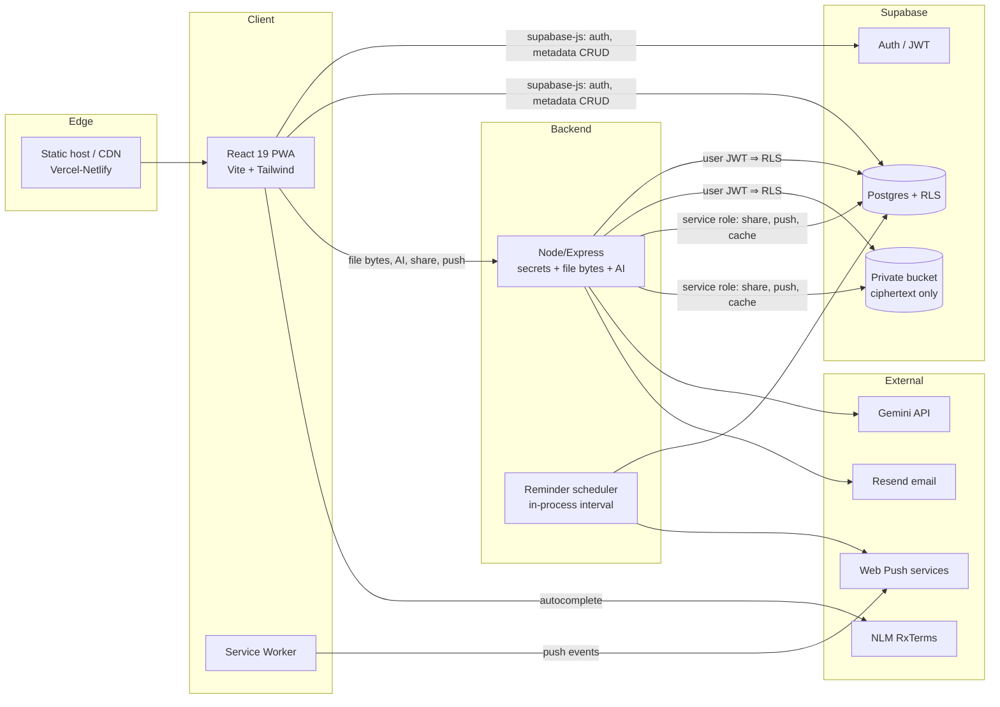
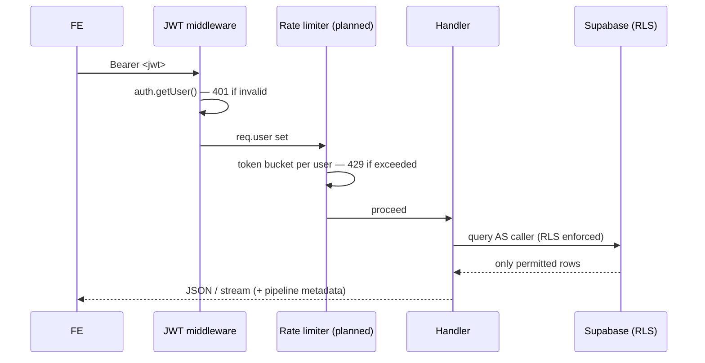
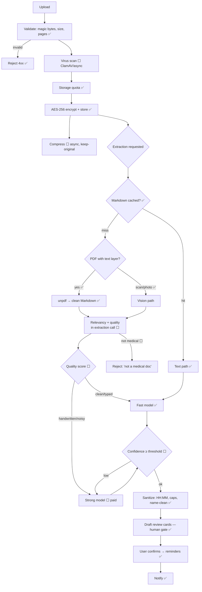
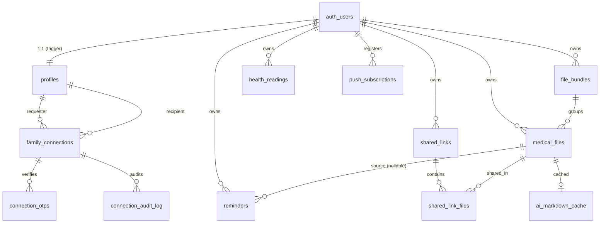
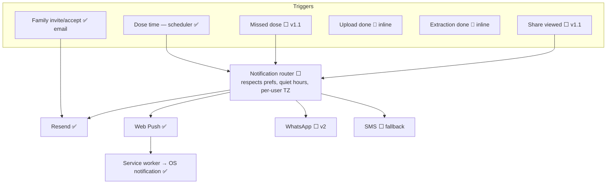
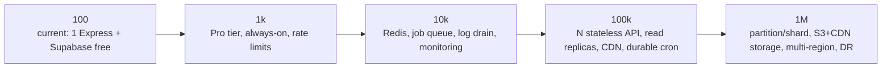

# EvoDoc — System Design

**Version:** 1.0 · **Companion:** [PRD.md](PRD.md) · **Reference:** [ARCHITECTURE.md](ARCHITECTURE.md), [SECURITY.md](SECURITY.md)

> Covers PRD deliverables **6–13, 15, 18**. Status markers: **✅ Built** ·
> **🔶 Partial** · **⬜ Planned**. Design decisions include alternatives
> considered and the recommendation, per the brief.

---

## 6. Backend Flow

### 6.1 Topology (current)

### 6.2 Layer responsibilities

| Concern | Where | Status | Design note |
|---|---|---|---|
| **Authentication** | Supabase Auth; JWT validated by Express middleware on every `/api/*` (except public share) | ✅ | `getUserFromToken` → `req.user`, `req.accessToken` |
| **Authorization** | Postgres RLS (owner + additive family policies); backend re-checks on service-role paths | ✅ | Defense-in-depth: app check *and* DB policy |
| **Upload** | `POST /api/files` (multer memory) → validate → quota → encrypt → store → metadata row | ✅ | Orphan cleanup if metadata insert fails |
| **Storage** | Private Supabase bucket; keys `<user_id>/<uuid>-<name>.enc` | ✅ | Ciphertext only; MIME locked to octet-stream |
| **Compression** | Ghostscript path via `GHOSTSCRIPT_PATH`; keep-original fallback | ⬜ | §12; needs host binary or paid API |
| **OCR / text** | `unpdf` text-layer extraction (digital PDFs) | ✅ | True OCR (scanned) handled by Gemini vision |
| **AI extraction** | `POST /api/ai/extract-medications`; Markdown or vision path | ✅ | §7 |
| **Model selection** | env `GEMINI_MODEL_FAST/STRONG` + quality routing | 🔶 | Router designed; Pro needs paid tier |
| **Notifications** | Web Push (VAPID) + Resend email | ✅ | §11 |
| **Reminder scheduling** | in-process 20s interval, minute-idempotent | ✅ | Migrate to durable cron at scale (§15) |
| **Caching** | `ai_markdown_cache` (per-file Markdown) | ✅ | Add Redis for sessions/rate-limits at scale |
| **Logging** | structured `console` with `[module]` tags | 🔶 | → pino + log drain (§15) |
| **Analytics** | pipeline metrics logged | 🔶 | → dashboard (ops) + PostHog (product) |
| **Database** | Supabase Postgres | ✅ | §9 |
| **Background jobs / queues** | none (synchronous) | ⬜ | BullMQ/pg-boss for AI + email at scale (§15) |
| **Cron** | in-process interval | 🔶 | → external scheduler / durable cron (§15) |
| **Rate limiting** | none | ⬜ | `express-rate-limit` now → Redis token bucket (§8) |
| **Error handling** | central Express handler + typed `UploadValidationError` | ✅ | Opaque 5xx in prod; specific 4xx for user-fixable |

### 6.3 Request lifecycle (authenticated)

---

## 7. AI Pipeline

### 7.1 Current vs. target

Your proposed pipeline is sound; my refinements: **(a)** run relevancy +
quality scoring *inside* the extraction call to avoid a second billed
round-trip, **(b)** make virus scan and compression async/non-blocking so the
user isn't stalled, **(c)** cache at the Markdown layer (built) so re-extraction
is free, **(d)** confidence-gated escalation flash→pro.

### 7.2 Key decisions

- **Relevancy (#6):** extend the response schema with
  `{ is_medical, doc_type, confidence, quality }`. If `is_medical=false` or
  `confidence < RELEVANCY_CONFIDENCE_THRESHOLD` → reject with a helpful message
  and log the classification. *Alternative — a separate cheap classifier call:
  rejected; doubles latency and cost for no accuracy gain since the extraction
  model already reads the whole doc.*
- **Model routing (#7):** quality signal comes from (a) text-layer char density
  (already computed in `pdfToMarkdown`), (b) the model's own `quality` field.
  Clean/typed → `GEMINI_MODEL_FAST`; handwritten/noisy/low-confidence →
  `GEMINI_MODEL_STRONG`, with **one** escalation retry. Every decision logged
  (`{ fileId, path, model, reason, confidence }`).
- **Token economics (#8, built ✅):** typed PDFs → Markdown text saves ~80%+
  tokens vs. billed page-images; measured 83% on a representative report.
  Cached per file so re-runs cost zero AI.
- **Safety invariant:** AI output *never* auto-persists. It only fills draft
  cards a human confirms — the single most important AI-risk control (PRD R4).

---

## 8. Security Design

*(Full current model in [SECURITY.md](SECURITY.md); here: strategy + gaps.)*

| Domain | Design & recommendation |
|---|---|
| **Authentication** | Supabase Auth, bcrypt (platform-managed). Prod: email confirmation ON, min-length + **leaked-password protection**, offer TOTP MFA (v1.1). |
| **JWT strategy** | Short-lived access JWT (1h) + refresh handled by `supabase-js`; validated server-side per request. Don't hand-roll JWTs. |
| **Refresh tokens** | Supabase rotating refresh tokens (httpOnly where possible). ⬜ device/session list + revoke (v2). |
| **OTP (#2 ✅)** | 6-digit, HMAC-hashed at rest (never plaintext), constant-time compare, 10-min TTL, single-use (deleted on success), 5-attempt lockout, resend cooldown + hourly cap, full audit log. |
| **Encryption** | AES-256-GCM envelope; per-file DEK wrapped by master key; ciphertext-only bucket. ⬜ `key_id` byte for rotation; escrow the master key. |
| **Secrets** | env only, gitignored; frontend gets publishable keys only. ⬜ migrate to a managed secret store (Doppler/Vault/cloud KMS) at scale. |
| **API security** | JWT middleware; CORS allow-list; ⬜ **global rate limiting** (P0 gap); ⬜ request-size caps per route; helmet headers. |
| **CSRF** | Low surface: auth is Bearer token (not cookies), so classic CSRF doesn't apply to `/api`. Keep tokens out of cookies to preserve this. |
| **XSS** | React escapes by default; no `dangerouslySetInnerHTML`; shared files rendered from a *different origin* (`*.supabase.co`) — but move file streaming behind the app origin carefully. ⬜ CSP header. SVG upload blocked (stored-XSS vector) via MIME allowlist. |
| **SQL injection** | None: Supabase client parameterizes; RPCs use bound params + static SQL; token format pre-checked by regex. |
| **Rate limiting** | ⬜ P0: `express-rate-limit` on `/api/ai/*` (per-user) and `/api/share/*` (per-IP); Redis-backed at multi-instance scale. |
| **Audit logs** | ✅ connection/OTP events. ⬜ share-access log (who viewed which link, hashed IP, when) — forensic + user-facing feature. |
| **Storage security** | private bucket, per-user folder RLS, service-role only after explicit token checks. |
| **HIPAA/GDPR/DPDP** | ⚠️ **P0 blocker: PHI must not hit training-eligible AI.** Paid/no-training Gemini + consent. DPAs with Supabase/Google/Resend. Data export + deletion rights (v1.1). Retention policy (§12). Not legal advice — counsel review before clinical marketing. |

---

## 9. Database Design

All tables: RLS enabled; UUID PKs; `created_at timestamptz default now()`.
**Soft-delete recommendation:** medical/legal data should be *soft-deleted*
(`deleted_at timestamptz`) with a purge job after the retention window, not
hard-deleted — supports "trash/restore" (PRD 4.3) and accidental-deletion
recovery. Currently deletes are hard; **v1.1 migration adds `deleted_at`** to
`medical_files`, `reminders`, `health_readings`, `file_bundles` and rewrites
RLS/queries to filter `deleted_at IS NULL`.

| Table | Purpose | Key columns | Indexes | Notes / status |
|---|---|---|---|---|
| `profiles` ✅ | user profile mirror | id→auth.users, full_name, email, date_of_birth | pk; email for invite lookup | email mirrored via trigger |
| `file_bundles` ✅ | health-event groups | user_id, name, description, event_date | (user_id) | delete → files' bundle_id SET NULL |
| `medical_files` ✅ | doc metadata | user_id, bundle_id, file_name, file_type, storage_path UNIQUE, size_bytes, category | (user_id), (bundle_id); ⬜(user_id,category) | ⬜ add deleted_at, original/compressed sizes |
| `shared_links` ✅ | share tokens | user_id, token UNIQUE, label, expires_at, revoked | (user_id),(token) | ⬜ store token_hash not token |
| `shared_link_files` ✅ | link↔file junction | (link_id,file_id) PK | pk | no URLs/credentials stored |
| `reminders` ✅ | med schedules | user_id, medication_name, dosage, frequency, times_of_day[], source, source_file_id, is_active | (user_id) | ⬜ add taken/skipped log table (v1.1) |
| `health_readings` ✅ | vitals | user_id, reading_type, value_primary/secondary, unit, context, measured_at | (user_id,type,measured_at) | |
| `family_connections` ✅ | account links | requester_id, recipient_id, status, responded_at | ⬜(requester,recipient,status) composite | drives is_family() |
| `connection_otps` ✅ | OTP handshake | connection_id, otp_hash, expires_at, attempts | pk(connection_id) | deleted on success (single-use) |
| `connection_audit_log` ✅ | invite/verify audit | connection_id, actor_id, action, detail, ip_hash | (connection_id),(actor_id) | append-only |
| `ai_markdown_cache` ✅ | extraction cache | file_id PK, markdown, metrics | pk | cascade-deletes with file |
| `push_subscriptions` ✅ | device push targets | user_id, endpoint UNIQUE, p256dh, auth | (user_id) | dead subs auto-pruned |
| ⬜ `dose_events` (v1.1) | taken/skipped log | reminder_id, user_id, scheduled_at, status, acted_at | (user_id,scheduled_at) | powers adherence + missed-dose alerts |
| ⬜ `share_access_log` (v1.1) | share views | link_id, viewed_at, ip_hash, user_agent | (link_id) | forensic + owner-facing |
| ⬜ `notifications` (v1.1) | notification center | user_id, type, payload, read_at | (user_id,read_at) | |

**Audit-field standard (v1.1):** every user-data table gains `created_at`,
`updated_at` (trigger), `deleted_at` (nullable). RLS policies extend with
`deleted_at IS NULL` on SELECT.

---

## 10. API Design

*(Base `/api`; all require Bearer JWT unless noted. Full request/response
shapes in [ARCHITECTURE.md](ARCHITECTURE.md) §7.)*

| Method · Route | Auth | Purpose | Success | Errors |
|---|---|---|---|---|
| `GET /health` | none | liveness | 200 `{ok}` | — |
| `POST /api/files` | JWT | encrypted upload (multipart) | 200 file row | 400/413/415/422 (validation/quota), 403 (family), 500 |
| `GET /api/files/usage` | JWT | quota status | 200 `{used,quota,available,percent}` | 500 |
| `GET /api/files/:id/view` | JWT | decrypt+stream | 200 bytes | 404, 500 |
| `POST /api/ai/extract-medications` | JWT | extract (file or storage_path) | 200 `{medications,pipeline}` | 404, 415, 429 (quota), 500 |
| `GET /api/share/:token` | none | share manifest | 200 `{share|null}` | 500 |
| `GET /api/share/:token/files/:id` | none | decrypt+stream shared file | 200 bytes | 404 (uniform), 500 |
| `POST /api/family/invite` | JWT | email code to recipient; create hidden `code_pending` | 200 uniform `{connection_id,needs_code}` | 400, 429, 500 |
| `POST /api/family/confirm-code` | JWT | **sender** enters recipient's code → invite revealed | 200 `{ok}` | 400 (wrong/expired), 429 (locked), 500 |
| `POST /api/family/resend-code` | JWT | sender re-sends code to recipient (cooldown/cap) | 200 | 404, 429, 500 |
| recipient accept/decline | JWT (RLS) | recipient responds to a revealed invite | direct Supabase update | — |
| `GET /api/push/public-key` | JWT | VAPID key | 200 `{publicKey}` | 503 |
| `POST /api/push/subscribe`·`/unsubscribe` | JWT | manage device | 200 `{ok}` | 400, 500 |
| `POST /api/push/test` | JWT | test notification | 200 `{sent,pruned}` | 503, 500 |
| ⬜ `GET /api/search` (v1.1) | JWT | search metadata+markdown | 200 results | — |
| ⬜ `POST /api/dose-events` (v1.1) | JWT | mark taken/skipped | 200 | — |
| ⬜ `GET/PATCH /api/profile` (v1.1) | JWT | profile + prefs | 200 | — |
| ⬜ `POST /api/account/export`·`DELETE /api/account` (v1.1) | JWT | GDPR/DPDP rights | 202 | — |
| ⬜ `/api/admin/*` (v2) | admin JWT+role | ops (metadata only) | — | 403 |

**Metadata CRUD** (files list, bundles, reminders, readings, share-link rows,
family list) goes **directly to Supabase via `supabase-js`**, RLS-protected —
not through Express. Rationale: RLS is the authority; proxying would add
latency and code with no security gain. Express owns only what needs a secret.

---

## 11. Notification System

| Notification | Channel | Status |
|---|---|---|
| Medication reminder | Push | ✅ |
| Missed-dose caregiver alert | Push + email | ⬜ v1.1 (needs `dose_events`) — **highest-retention feature** |
| Family invite | Email (OTP) | ✅ |
| Family accepted | Push/email | ⬜ v1.1 |
| Upload/extraction complete | In-app | 🔶 (synchronous today; async when queued) |
| Share viewed | Push/in-app | ⬜ v1.1 |

**Channel strategy — recommendation:** Push (built) → Email (built) → **WhatsApp
(v2)** → SMS (last-resort fallback). *For the India market, WhatsApp Business API
beats SMS: cheaper at volume, richer, and the elderly persona already lives in
WhatsApp. SMS only where WhatsApp/push both fail.* A `notifications` table +
preference center + per-user timezone + quiet hours are v1.1 prerequisites so
the router honors user choice and never wakes someone at 3am.

---

## 12. File Processing Pipeline

| Stage | Status | Design |
|---|---|---|
| Upload | ✅ | multipart → memory buffer; multer size ceiling |
| Validation | ✅ | magic bytes, size, page count, encryption/corruption → typed 4xx |
| Virus scan | ⬜ | ClamAV sidecar or API, **async** post-store; quarantine flag until clean |
| Compression | ⬜ | Ghostscript (`GHOSTSCRIPT_PATH`); store compressed only if saving ≥ `COMPRESSION_MIN_SAVING_RATIO`; keep both sizes in metadata; **keep original if not meaningfully smaller** |
| OCR / text | ✅ | `unpdf` text layer; scanned → Gemini vision OCR |
| Markdown | ✅ | clean structured MD; cached; metrics logged |
| Extraction | ✅ | §7 |
| Storage | ✅ | AES-256 envelope; ciphertext-only bucket |
| Deletion | 🔶→⬜ | hard today → **soft-delete + purge job** (v1.1) |
| Retention | ⬜ | configurable window; auto-purge soft-deleted; legal-hold exception |
| Versioning | ⬜ | replace-file keeps prior version (v2); `medical_files.version`, `supersedes_id` |
| Recovery | ⬜ | trash restore (v1.1); PITR backups (§15); master-key escrow (R2) |

---

## 13. Edge Cases (QA matrix)

| Case | Handling | Status |
|---|---|---|
| Poor scan / low-res | text-layer char check → vision fallback; quality routing → strong model | ✅ / ⬜ routing |
| Handwritten Rx | no text layer → vision path; strong-model escalation; **human review catches errors** | ✅ / ⬜ escalation |
| Duplicate upload | ⬜ content hash (`sha256`) dedupe warning; today creates two rows | ⬜ v1.1 |
| Wrong document type | ⬜ relevancy classifier rejects invoices/receipts | ⬜ v1.1 |
| Storage full | pre-upload quota check → 413 with used/limit; dashboard warns 70/90% | ✅ |
| OCR/extraction failure | 0 meds → info notice + manual-entry pointer; never a hard crash | ✅ |
| AI timeout | ⬜ request timeout + retry-once; user-facing "try again"; async job at scale | 🔶 |
| Reminder delivery failure | dead-subscription pruning; ⬜ email fallback on push failure | ✅ / ⬜ |
| Offline mode | shell loads (SW); ⬜ offline banner + queued upload | 🔶 |
| Network interruption mid-upload | multipart re-upload; ⬜ resumable (tus) for large files | 🔶 |
| Expired OTP | explicit "expired, request new"; resend flow | ✅ |
| Wrong OTP ×N | attempts counter, lockout at 5, audit-logged | ✅ |
| Concurrent uploads | independent requests; quota checked per request (⚠️ small TOCTOU race — mitigate with DB-side check or advisory lock, v1.1) | 🔶 |
| Large PDF | 15MB/6-page cap; ⚠️ full buffer in RAM → concurrency semaphore + streaming envelope (v2) | 🔶 |
| Low-confidence extraction | ⬜ threshold → escalate to strong model, then flag for manual | ⬜ v1.1 |
| Corrupted file | pdf-lib parse failure → 422 "corrupted"; GCM tag failure on decrypt → hard error not garbage | ✅ |
| Partial failure (upload ok, metadata fails) | orphan object removed | ✅ |
| Family member deleted mid-session | is_family() re-evaluated per query; person switcher falls back to self | ✅ |
| Share revoked mid-view | next file request 404s (per-request revalidation) | ✅ |
| Master key lost | ⚠️ unrecoverable — **escrow + key_id rotation path** (R2) | ⬜ |

---

## 15. Scalability

| Concern | 100 | 1k | 10k | 100k | 1M |
|---|---|---|---|---|---|
| **Database** | Supabase free | Pro | connection pooler (pgbouncer/Supavisor), indexes | read replicas, `dose_events` partitioned by month | shard by user_id / regional clusters |
| **Caching** | none | none | Redis: rate-limit + session + hot metadata | Redis cluster | edge cache read-only manifests |
| **Queues** | synchronous | synchronous | pg-boss/BullMQ for AI + email + virus scan | dedicated workers autoscaled | priority lanes; backpressure |
| **CDN** | host default | host CDN | static via CDN | + signed edge for previews | multi-region edge |
| **Storage** | Supabase bucket | same | same | evaluate S3 + CloudFront | S3 + lifecycle tiers + CDN |
| **Horizontal scaling** | 1 instance | 1 always-on | N stateless behind LB (move scheduler OUT of process) | autoscale group | multi-region active-active |
| **Scheduler** | in-process ⚠️ | in-process | **external durable cron** (one owner) — in-process breaks with N instances | distributed lock / dedicated service | sharded by timezone |
| **Monitoring** | logs | uptime ping | Sentry + metrics (p95, error rate, AI cost) | full APM, SLO alerts | multi-region dashboards |
| **Logging** | console | console | pino → drain (Logtail/Datadog) | structured + trace IDs | sampled + retained |
| **Backups** | Supabase daily | daily | PITR | PITR + tested restores | cross-region + DR drills |
| **DR** | none | manual | documented runbook, RTO/RPO targets | warm standby | active-active failover |

**Critical scaling refactors (in priority order):** (1) move the reminder
scheduler **out of the API process** before running >1 instance — an in-process
interval fires N times with N instances; (2) rate limiting on Redis, not
in-memory; (3) job queue for AI/email so a slow Gemini call doesn't hold a
request thread; (4) streaming/chunked encryption to end RAM-buffering (memory
ceiling); (5) storage egress review (backend proxies every byte — CDN or signed
direct-download for owner previews at scale, while keeping share revocation).

---

## 18. Final Architecture Review (Staff Engineer)

**What's genuinely strong** (rare for an MVP): RLS on every table as the real
authority; application-level envelope encryption (ciphertext-only bucket);
instant-revocable sharing via per-request revalidation; OTP linking done to
spec (hashed, single-use, rate-limited, audited); AI with a human-review gate
and an ~83% token-cost optimization; and a test suite that verified
ciphertext-at-rest, instant revocation, and tamper detection. This is a
well-reasoned security core.

**Weaknesses & what could block production:**

1. **PHI → training-eligible AI (P0, existential).** Free-tier Gemini may use
   inputs for training. Paid/no-training tier + consent *before* any real
   patient data. Non-negotiable.
2. **No rate limiting (P0).** Every `/api` route is floodable; the AI and public
   share paths are the exposed, expensive ones. `express-rate-limit` now,
   Redis-backed later.
3. **Scheduler in-process (P0 for scale).** Correct at one instance; double-fires
   at two. Externalize before horizontal scaling.
4. **RAM-buffered crypto (P1).** Whole files in memory → OOM risk under
   concurrency on small instances. Semaphore now; chunked streaming envelope
   later (a real format migration — add `key_id` at the same time).
5. **Master-key doomsday (P1).** No escrow, no rotation path. One lost env file =
   total permanent data loss. Escrow + `key_id` byte immediately.
6. **Plaintext share tokens + no share-access log (P1).** Hash tokens at rest;
   add the access log (also a user-facing feature).
7. **No soft-delete / retention / export / deletion (P1, compliance).** DPDP/GDPR
   need export + deletion rights and a retention policy; medical data wants
   soft-delete + restore regardless.
8. **Missing retention hook (product-critical).** The reminder feature can't yet
   record taken/skipped, so there's no adherence loop and no missed-dose
   caregiver alert — the very thing that would make Priya open the app weekly.
   This is the most important *product* gap, above most technical ones.

**Bottlenecks:** storage egress (double-proxied bytes); single API process;
synchronous AI calls holding threads; unbounded list queries + `is_family()`
per-row function calls without the composite index.

**Cost optimizations:** Markdown path (done) + extraction cache (done) +
per-user AI rate limits + budget alerts; right-size the always-on instance;
tiered storage lifecycle at scale.

**UX priorities:** landing page (there's no front door), password-reset UI,
notification center + preferences + per-user timezone, offline banner, dark
mode, mobile bottom-nav + camera-first capture.

**Verdict:** The foundation is production-*grade* in its security design and
unusually honest about its gaps. It is **not production-*ready*** until the P0
items (AI compliance, rate limiting, externalized scheduler) and the P1
compliance/key-management items are closed. None require redesign — they're additive to a
sound architecture, which is the best outcome a review like this can report.
Ship the P0 list, then the v1.1 adherence loop; that sequence turns a
well-built demo into a defensible product.
